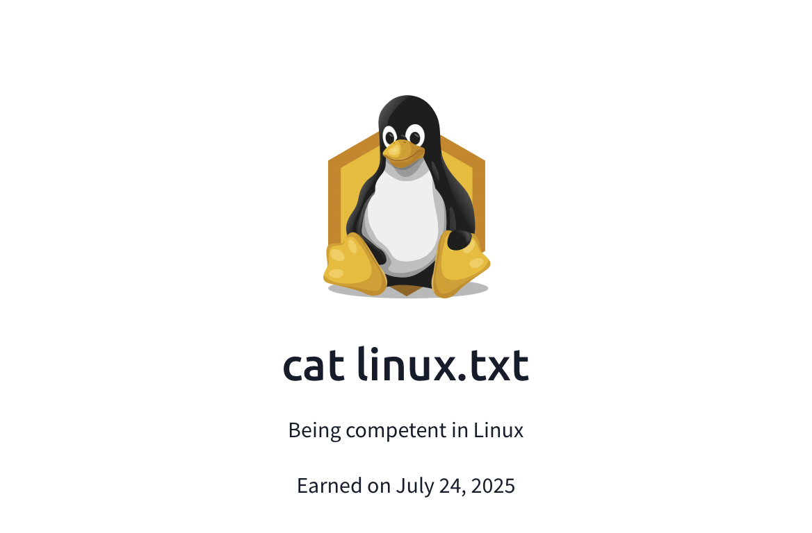

# certifications
A collection of my verified certifications including internships and technical achievements.
# 🎓 Certifications

## 🔐 Cybersecurity

- [Deloitte Cybersecurity Virtual Internship (Forage)](./Deloitte_Cybersecurity_Internship_Certificate.pdf)
   _Issued: June 2025_

- **Mastercard Cybersecurity Job Simulation** – [Forage](https://www.theforage.com)  
  *Issued: July 2025*  
  [View Certificate](./Mastercard_Cybersecurity_Internship_Certificate.pdf)

  - **TATA Cybersecurity Analyst Job Simulation – Forage**  
  *Earned: August 11, 2025*  
  Practical tasks in:
  - Identity and Access Management (IAM) fundamentals
  - IAM strategy assessment
  - Crafting custom IAM solutions
  - Platform integration  
  [View Certificate](tata-cybersecurity-certificate.pdf)

### 🐧 Linux
- **cat linux.txt**  
  *Earned: July 24, 2025*  
  Being competent in Linux  
  

  
## 💻 Web Development

- [Responsive Web Design Certificate – freeCodeCamp (Aug 2024)](./Responsive_Web_Design_Certificate.pdf)  
  [🔗 Verify on freeCodeCamp](https://www.freecodecamp.org/certification/fcc6116bee8-0784-437c-a2ce-18c40beeb344/responsive-web-design)

